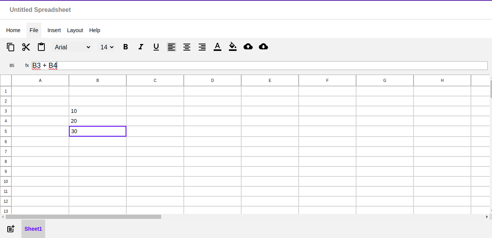

# Google Sheets Clone

## Introduction

This project is a partial clone of Google Sheets, designed to provide essential features for creating and managing spreadsheets. It allows users to add text to cells, modify text size and style, apply bold, italic, and underline formatting, align text within cells, add background fill, and evaluate formulas using infix to postfix conversion.

## Features

- **Text Editing**: Users can add and edit text within cells.
- **Text Formatting**:
  - **Size**: Modify the size of the text.
  - **Style**: Change the font style.
  - **Bold**, **Italic**, and **Underline**: Apply these formats to the text.
- **Text Alignment**: Align text horizontally and vertically within cells.
- **Background Fill**: Add background colors to cells.
- **Formula Evaluation**: Evaluate mathematical formulas using infix to postfix conversion.

## Installation

To use this Google Sheets clone, follow these steps:

1. Clone the repository.
2. Install any required dependencies.
3. Run the application.

### Example Installation Commands

Clone the repository
```bash
git clone https://github.com/RoystonDAlmeida/sheets-app.git
```

Navigate to the project directory
```bash
cd sheets-app/
```

Install dependencies (if any)
```bash
npm install
```

Run the application
```bash
npm start
```

### Adding Text and Formatting

1. Open the application and create a new spreadsheet(by clicking on the plus icon to the bottom left of the screen).
2. Click on a cell to add text.
3. Use the formatting options to change text size, style, and apply bold, italic, or underline.

### Evaluating Formulas

1. Enter a formula in the formula bar using cell references(eg: B2 + B3)
2. The formula will be automatically converted to postfix notation, evaluated and will be entered in the focused cell.

### Image



### Adding Background Fill

1. Select a cell or group of cells.
2. Choose a background color from the available options.

## Contributing

Contributions are welcome! If you have ideas for new features or improvements, please submit a pull request or open an issue.